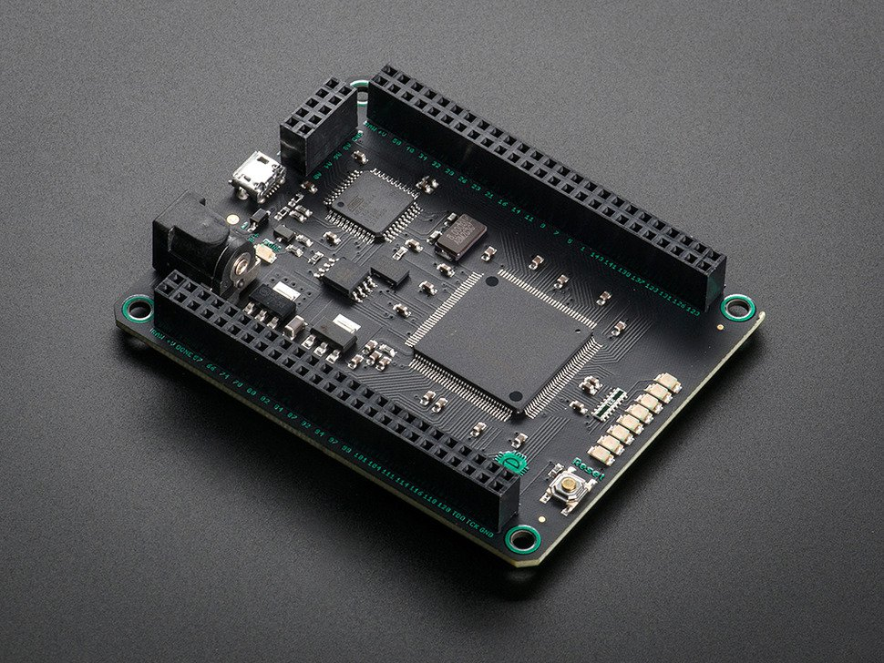

###########################################################################################
 IoT Without a Net: A Practical Guide To Working With Microcontrollers The Open Source Way
###########################################################################################

.. image:: images/pmezydlo_pru-spi-slave.png
   :align: center
   :width: 85%

.. contents:: Presentation Outline

.. raw:: pdf

   SetPageCounter

Exactly What Kind of Hardware Are We Talking About?
===================================================

* Primary Characteristics

  - Stand-alone or separate real-time CPU core(s)
  - Can also come in combination or hybrid configurations
  - Requires firmware loaded at runtime to do something
  - Includes both hard and soft processor cores
  - Interfaces for debug and/or communication with Linux runtime

* Typical Applications

  - IoT, industrial, automotive, consumer, hobbyist

    + Machine control (3D printing, milling, process control)
    + Car navigation, entertainment, communication
    + Door/entry control, locks, power, LEDs, appliances
    + Autopilots (drones, rovers, UAVs) and robotics
    + Wearables, instrumentation, mesh networks

.. raw:: pdf

   PageBreak twoColumn

Example Reference Architecture
===============================

.. raw:: pdf

   Spacer 0 1cm

.. image:: images/micro_arch_generic.jpg
   :align: center
   :width: 95%

.. raw:: pdf

   FrameBreak

.. raw:: pdf

   Spacer 0 3cm

**"A microcontroller (or MCU, short for microcontroller unit) is a small computer or System on Chip (SoC) in a single integrated circuit containing a processor core, memory, and programmable I/O peripherals (may also include program memory)."**
   
   [1] https://en.wikipedia.org/wiki/Microcontroller

Example Boards
==============

.. figure:: images/arduino-publicdomain.png
   :width: 90%
   :align: center

   AVR/ARM: Arduinos

   Spartan 6 XC6SLX9 FPGA

.. raw:: pdf

   FrameBreak

.. figure:: images/ESP8266_coincell.jpg
   :width: 60%
   :align: right

   Xtensa LX-106: ESP8266

.. raw:: pdf

    Spacer 0 1cm

.. figure:: images/propeller_quickstart.png
   :width: 70%
   :align: right

   P8X32A microcontroller

.. raw:: pdf

   PageBreak cutePage

Microcontroller Architecture / CPU Families
===========================================

+ 4 most "common" architecture families in DIY and FOSS

  * 8051, PIC and AVR are `Harvard architecture`_, which uses separate memory spaces for RAM and programs, while ARM is `von Neumann architecture`_ (program and RAM share the same memory space)
  * ARM is a 16 or 32 bit architecture, others are byte (8-bit) architecture
  * 8051 and PIC have limited stack space - limited to 128 bytes for the 8051, 8 words or less for PIC
  * 8051, AVR and ARM can directly address all available RAM, while PIC can only directly address 256 bytes
  * 8051 and PIC need multiple clock cycles per instruction, while AVR and ARM can execute most instructions in a single clock cycle
  * AVR and ARM have great open source compilers, libs, examples
+ Still around: PowerPC, MIPS, STM, TI, Toshiba, Freescale/NXP, etc
+ Combination and Hybrid Architectures/Implementations

  * `PRU-ICSS / PRUSSv2`_ - Programmable Real-Time Unit and Industrial Communication Subsystem
  * DSP - Digital Signal Processor
  * FPGA - Field Programmable Gate Array
  * Massively Parallel - Parallax Cog/Hub, Parallela, Transputer

.. _Harvard architecture: https://en.wikipedia.org/wiki/Harvard_architecture
.. _von Neumann architecture: https://en.wikipedia.org/wiki/Von_Neumann_architecture
.. _PRU-ICSS / PRUSSv2: http://elinux.org/Ti_AM33XX_PRUSSv2

Hybrid and "Combo" Boards
=========================

What About Software Tools?
==========================

Toolchains, SDKs, and Architectures
===================================

Bare-Metal and Firmware
-----------------------

Each micro-controller/real-time core has an architecture and instruction set,
which any toolchain must support (or at least a viable subset).  Most have
both vendor support and a gcc port, although in some cases the gcc port might
be new and essentially still under development (eg, the TI PRUSS toolchain).

The toolchain itself is mainly the compiler/linker/loader and a standard C
library (of which there are several).  In order to build anything "fancy" you
also need a Software Development Kit (or SDK).  Sometimes you can live with
either the compiler runtime and/or libc, but a good set of libraries with
documented interfaces is always a Good Thing.  Depending on the target arch
there is almost always a vendor SDK and probably open source alternatives.

You should always do your homework (for a real project) or just pick one and
try it and see...

* `AVR-Ada Blog`_ by Tero Koskinen

  * `tkoskine bitbucket repos`_ - Tools for AVR and ARM in multiple languages

.. _AVR-Ada Blog: http://arduino.ada-language.com/
.. _tkoskine bitbucket repos: https://bitbucket.org/tkoskine/

Vendor vs. Open Source Tools
============================

Example: ESP8266, Adafruit Feather HUZZAH
=========================================

ESP8266 Cont.
=============

Example: PRU-ICSS, TI BeagleBoneBlack
=====================================

PRU-ICSS Cont.
==============

Example: Atmel SAM3X8E, Udoo / Udoo Neo
=======================================

SAM3X8E Cont.
=============

How To Choose?
==============

Where to Go Next
================

License and Thanks!
===================

:Author: Stephen L Arnold
:FOSS Hat: Gentoo Linux Developer
:Contact: nerdboy@gentoo.org
:Revision: 0.1
:Date: |date|, |time| PST8PDT
:License: `CC-Attribution-ShareAlike`_
:Copyright: 2016 `Stephen Arnold`_

.. _CC-Attribution-ShareAlike: http://creativecommons.org/licenses/by-sa/3.0/
.. _Stephen Arnold: http://github.com/sarnold

.. raw:: pdf

    Spacer 0 5mm

.. image:: images/cc3.png
   :align: left
   :width: .5in

.. |date| date::
.. |time| date:: %H:%M

