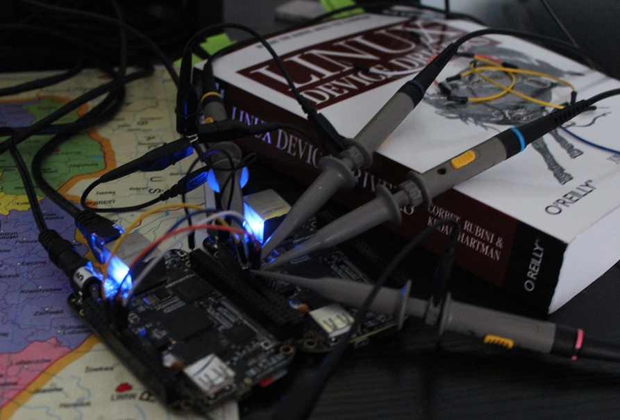
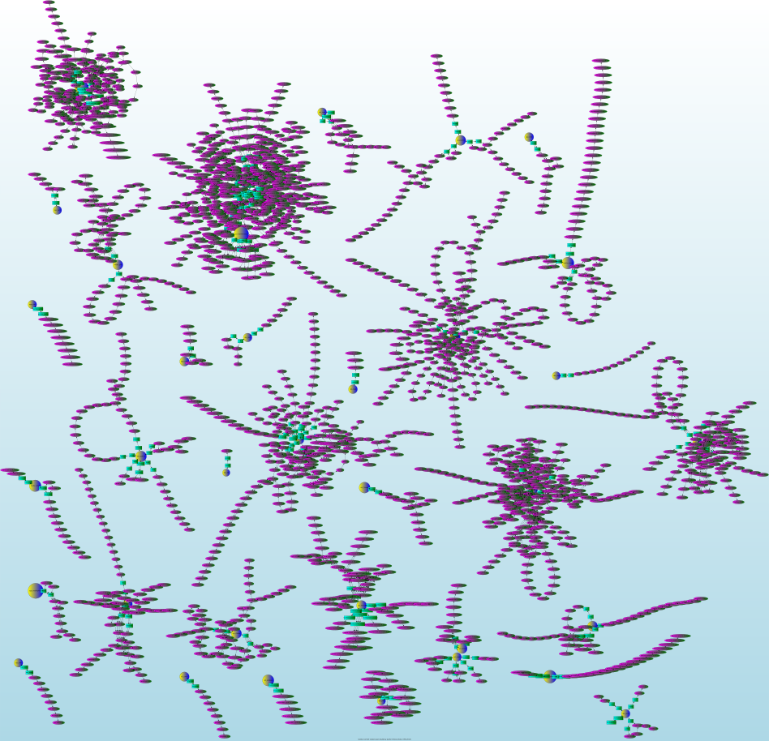
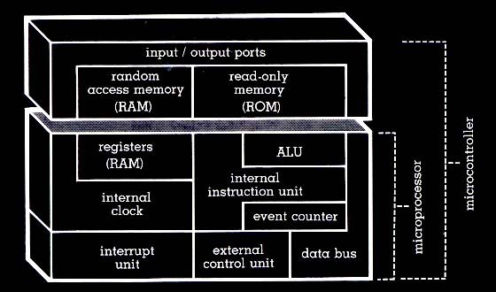
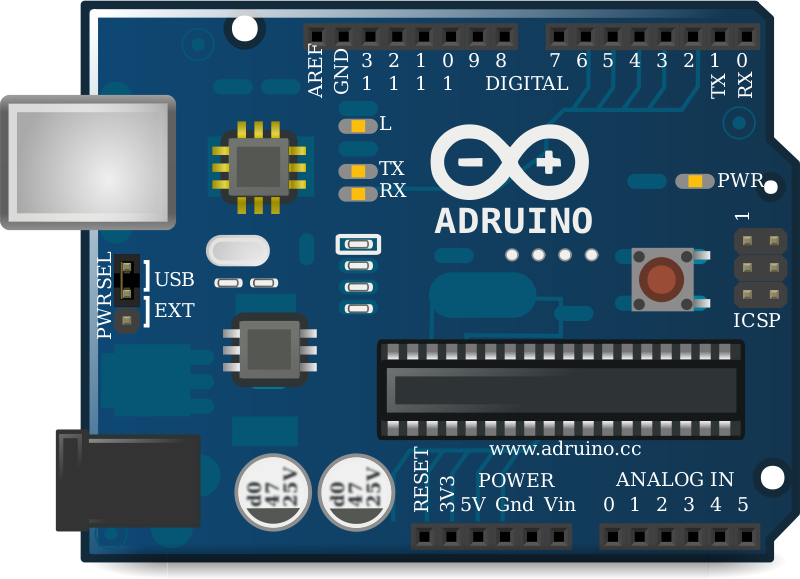
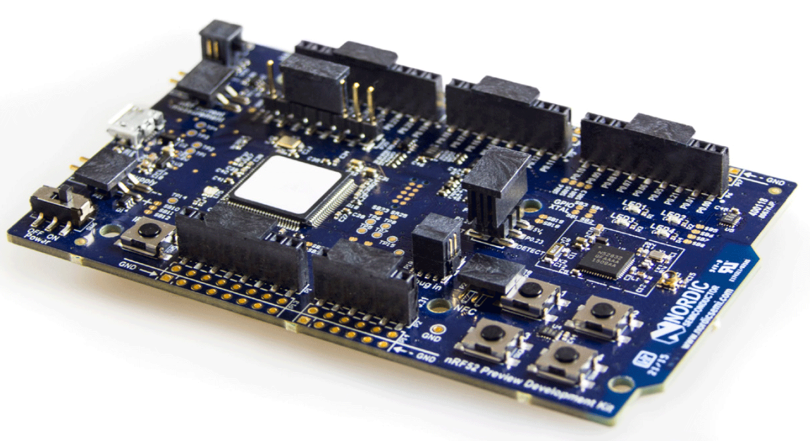
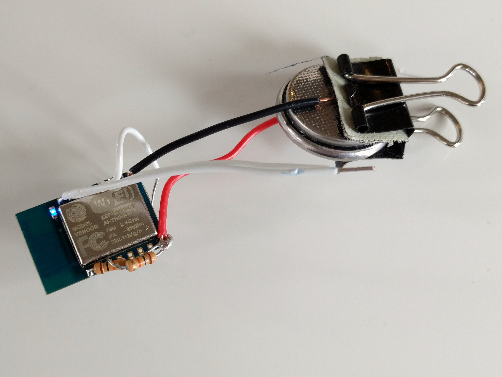
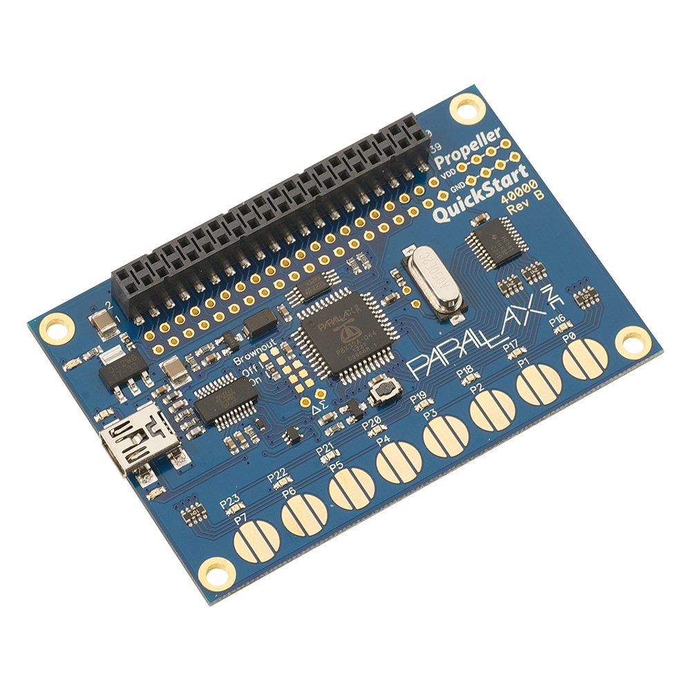
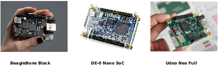

###########################################################################################
 IoT Without a Net: A Practical Guide To Working With Microcontrollers The Open Source Way
###########################################################################################

.. contents:: Presentation Outline

.. raw:: pdf

   SetPageCounter

.. raw:: pdf

   PageBreak twoColumn

Who Am I?
=========

.. raw:: pdf

   Spacer 0 1cm

**Gentoo Linux Developer**

**OpenEmbedded contributor**

.. raw:: pdf

   Spacer 0 1cm

**BeagleBoard GSoC Mentor**

**Grumpy toolchain guy (part-time)**

**Geeky software tool maintainer**

http://bbb.io/gsoc
https://github.com/sarnold
https://github.com/VCTLabs

.. raw:: pdf

   Spacer 0 1cm

**Systems Architecture guy**

**Principal Scientist VCT Labs**

.. raw:: pdf

   FrameBreak

.. raw:: pdf

   Spacer 0 5mm

.. raw:: pdf

   Spacer 0 1cm

.. raw:: pdf

   Spacer 0 2cm

.. raw:: pdf

   PageBreak cutePage

Exactly What Kind of Hardware Are We Talking About?
===================================================

* Primary Characteristics

  - Stand-alone or separate real-time CPU core(s)
  - Can also come in combination or hybrid configurations
  - Requires firmware flashing to do something
  - Includes both hard and soft processor cores
  - Interfaces for debug, RAM/peripherals, Linux runtime

* Typical Applications

  - IoT, industrial, automotive, consumer, hobbyist

    + Fixed and mobile sensor platforms

      * Wearables, remote instrumentation, mesh networks
      * Autopilots (drones, rovers, UAVs) and robotics
      * Vehicle navigation, entertainment, communication

    + Machine control (3D printing, milling, process control)
    + Door/entry control, locks, power, LEDs, appliances

.. raw:: pdf

   PageBreak twoColumn

Example Reference Architecture
===============================

.. raw:: pdf

   Spacer 0 1cm

.. raw:: pdf

   FrameBreak

.. raw:: pdf

   Spacer 0 3cm

**"A microcontroller (or MCU, short for microcontroller unit) is a small computer or System on Chip (SoC) in a single integrated circuit containing a processor core, memory, and programmable I/O peripherals (may also include program memory)."**
   
   [1] https://en.wikipedia.org/wiki/Microcontroller

Example Boards
==============

   AVR/ARM: Arduinos

   Cortex-M4: nRF52 DK

.. raw:: pdf

   FrameBreak

   Xtensa LX-106: ESP8266

.. raw:: pdf

    Spacer 0 1cm

   P8X32A microcontroller

.. raw:: pdf

   PageBreak cutePage

Microcontroller Architecture / CPU Families
===========================================

+ 4 most "common" architecture families in DIY and FOSS

  * 8051, PIC and AVR are `Harvard architecture`_, which uses separate memory spaces for RAM and programs, while ARM is `von Neumann architecture`_ (program and RAM share the same memory space)
  * ARM is a 16 or 32 bit architecture, others are byte (8-bit) architecture
  * 8051 and PIC have limited stack space - limited to 128 bytes for the 8051, 8 words or less for PIC
  * 8051, AVR and ARM can directly address all available RAM, while PIC can only directly address 256 bytes
  * 8051 and PIC need multiple clock cycles per instruction, while AVR and ARM can execute most instructions in a single clock cycle
  * AVR and ARM have great open source compilers, libs, examples
+ Still around: PowerPC, MIPS, STM, TI, Toshiba, Freescale/NXP, etc
+ Combination/Hybrid and Special Purpose Architectures/Implementations

  * `PRU-ICSS / PRUSSv2`_ - Programmable Real-Time Unit and Industrial Communication Subsystem
  * DSP - `Digital Signal Processor`_
  * FPGA - `Field Programmable Gate Array`_
  * Massively Parallel - `Parallax Propeller`_, `Parallela`_, `Transputer`_

.. _Harvard architecture: https://en.wikipedia.org/wiki/Harvard_architecture
.. _von Neumann architecture: https://en.wikipedia.org/wiki/Von_Neumann_architecture
.. _PRU-ICSS / PRUSSv2: http://elinux.org/Ti_AM33XX_PRUSSv2
.. _Digital Signal Processor: https://en.wikipedia.org/wiki/Digital_signal_processor
.. _Field Programmable Gate Array: https://en.wikipedia.org/wiki/Field-programmable_gate_array
.. _Parallax Propeller: https://en.wikipedia.org/wiki/Parallax_Propeller
.. _Parallela: https://www.parallella.org/board/
.. _Transputer: https://en.wikipedia.org/wiki/Transputer

Hybrid and "Combo" Boards
=========================

Most embedded Linux boards have co-processors for graphics or network acceleration
but here we're talking about something a little different.  While the bulk of
microcontrollers are stand-alone, there are several options available with both
an ARM host and separate microcontroller cores.

* General purpose microcontrollers (not DSPs)
* Can be Cortex (ARM), AVR, FPGA, other

Examples:

* TI Beagleboard / Beaglebone boards (AM335X ARMv7 w/ PRU cores)
* Altera "hybrid" Arm/FPGA boards (socfpga ARMv7 w/ 1 CycloneV FPGA)
* Udoo / Udoo Neo boards (i.MX6 ARMv7 w/ 1 ARM Cortex-M core)

What About Software Tools?
==========================

.. epigraph::

   *Just like every (beagle) dog has his/her day, every arch has its toolchain...*
   
   -- *nerdboy in #gentoo-embedded*

.. raw:: pdf

    Spacer 0 5mm

The typical embedded Linux cross-toolchain is built to target processor
architectures different from the build host and has 4 main parts:

* a cross compiler for C and C++ (in the case of gcc, possibly more languages)
* a cross binutils (the build tools needed by the compiler)
* a set of libraries and headers for the supported languages
* a set of kernel headers for the target platform

The `(cross) compiler prefix`_ (triplet) contains several bits of important info:

* machine-vendor-OS (where OS can be two fields and vendor can be left out)

::

 # gcc-config -l
 [1] armv7a-hardfloat-linux-gnueabi-5.4.0 *
 [2] armv7m-hardfloat-eabi-5.4.0 *
 [4] mips64-unknown-linux-gnueabi-5.3.0 *
 [8] x86_64-pc-linux-gnu-5.4.0 *

.. _(cross) compiler prefix: http://wiki.osdev.org/Target_Triplet

Toolchains, SDKs, and Architectures
===================================

Bare-Metal and Firmware
-----------------------

Each micro-controller/real-time core has an architecture and instruction set,
which any toolchain must support (or at least a viable subset).  Most have
both vendor support and a gcc port, although in some cases the gcc port might
be new and essentially still under development (eg, the TI PRUSS toolchain).

The toolchain itself is mainly the compiler/linker/loader and a standard C
library (of which there are several).  In order to build anything "fancy" you
also need a Software Development Kit (or SDK).  Sometimes you can live with
either the compiler runtime and/or libc, but a good set of libraries with
documented interfaces is always a Good Thing.  Depending on the target board
there is typically a vendor SDK and (hopefully) several open source alternatives.

* `AVR-Ada Blog`_ by Tero Koskinen

  * `tkoskine bitbucket repos`_ - Tools for AVR and ARM in multiple languages

.. _AVR-Ada Blog: http://arduino.ada-language.com/
.. _tkoskine bitbucket repos: https://bitbucket.org/tkoskine/

* `Embedded Project Blog`_ - by Stefan Wendler

  * `wendlers github installer`_ - Best installer for propeller tools

.. _Embedded Project Blog: http://www.kaltpost.de/?page_id=63
.. _wendlers github installer: https://github.com/wendlers/install-propeller-toolchain

You should always do your homework (for a real project) or just pick one and
try it and see...

Vendor vs. Open Source Tools
============================

Vendor boards typically have a vendor SDK and vendor toolchain options (sometimes
including GCC) whereas open source hardware generally relies on a GCC toolchain
(with some interesting exceptions).  The more "mainstream" the architecture, the
more likely it is to have a mature GCC option.

"Common" architectures

* ARM: Cortex-M/R "official" toolchain is `GNU ARM`_
* AVR: Atmel Studio is based on `GNU AVR`_

"Oddball" architectures

* `PRU-ICSS`_: "official" toolchain w/ full debug support is `CGT`_ and `CCS`_
* Parallax Propeller (original) toolchain is based on `SPIN`_

The rub: FPGAs

* FPGAs tend to be more `vendor-specific`_ (both hardware and toolchains)
* `Open source firmware toolchains`_ do exist (some components may be missing and/or immature)
* Each board typically has its own interface to host side and may require `custom Linux integration`_, etc
* Peripherals implemented on the FPGA side may also need custom DT and driver support for Linux, etc

.. _GNU ARM: https://developer.arm.com/open-source/gnu-toolchain/gnu-rm
.. _GNU AVR: http://gnutoolchains.com/avr/
.. _PRU-ICSS: http://processors.wiki.ti.com/index.php/PRU-ICSS
.. _CGT: http://software-dl.ti.com/codegen/non-esd/downloads/download.htm#PRU
.. _CCS: http://www.ti.com/tool/ccstudio-sitara
.. _SPIN: http://www.learn.parallax.com/projects/propeller-spin-language
.. _vendor-specific: https://coertvonk.com/technology/logic/quartus-cycloneiv-de0nano-15932
.. _Open source firmware toolchains: http://www.clifford.at/icestorm/
.. _custom Linux integration: https://github.com/VCTLabs/u-boot/blob/v2016.03-yocto/doc/README.socfpga

Example: nRF52 DK (nRF52 2.4 GHz tx/rx plus Cortex-M4)
======================================================

Debug from x86 and RPi3

Example: DE-0 Nano SoC (FPGA plus ARM Cortex-A9)
================================================

Linux - FPGA Integration

Example: PRU-ICSS, TI AM335x, AM437x, AM571x
============================================

Kernels and kernels and PRUSS interfaces

PRU-ICSS Cont.
==============

How To Choose?
==============

It depends.   What do you want to do?  Educate yourself?  Make a cool project?
Prototype a product idea?  Automate something?

.. raw:: pdf

    Spacer 0 5mm

* Education - maker space, LUG group, home

  - Very little open source/popular hardware is truly mainlined
  - Pick a board off the LinuxOnArm wiki
  - Pick a board used at the hacker space or recommended by a friend
  - Pick a board with a large community and lots of projects

* Commercial product - kickstarter, customer, boss

  - Understand the project requirements
  - Evaluate some eval boards
  - Understand the hardware limitations
  - Evaluate the kernel and runtime needs
  - Evauluate performance/other reqs vs. BoM costs

Where to Go Next
================

nRF52 DK and toolchain, flash wrapper

 * https://www.nordicsemi.com/eng/Products/Bluetooth-low-enery/nRF52-DK
 * https://developer.arm.com/open-source/gnu-toolchain/gnu-rm
 * https://github.com/VCTLabs/nrfjprog-wrapper

BeagleBone/BeagleBoard info, PRU toolchain, Yocto BSP manifest

 * https://eewiki.net/display/linuxonarm/BeagleBone+Black
 * http://elinux.org/Ti_AM33XX_PRUSSv2
 * https://github.com/VCTLabs/vct-beagleboard-bsp-platform

DE-0 Nano SoC info, updated demo projects, BSP manifest, vendor refs

 * https://eewiki.net/display/linuxonarm/DE0-Nano-SoC+Kit
 * https://github.com/VCTLabs/DE1_SOC_Linux_FB
 * https://github.com/VCTLabs/DE1-SoC-Sound
 * https://github.com/VCTLabs/vct-socfpga-bsp-platform
 * https://github.com/altera-opensource/linux-refdesigns

License and Thanks!
===================

:Author: Stephen L Arnold
:FOSS Hat: Gentoo Linux Developer
:Contact: nerdboy@gentoo.org
:Revision: 0.0.1
:Date: |date|, |time| PST8PDT
:License: `CC-Attribution-ShareAlike`_
:Copyright: 2017 `Stephen Arnold`_
:Other: All other trademarks and copyrights belong to their respective owners.

.. _CC-Attribution-ShareAlike: http://creativecommons.org/licenses/by-sa/3.0/
.. _Stephen Arnold: http://github.com/sarnold

.. raw:: pdf

    Spacer 0 5mm

.. |date| date::
.. |time| date:: %H:%M

